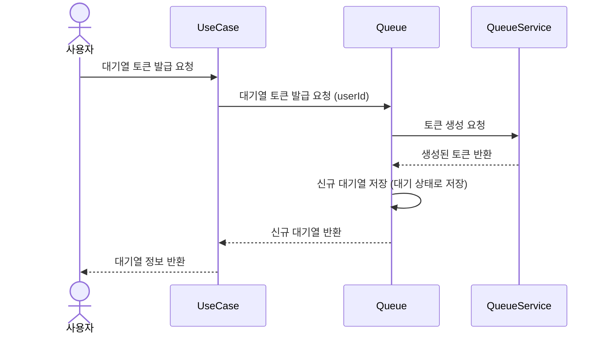
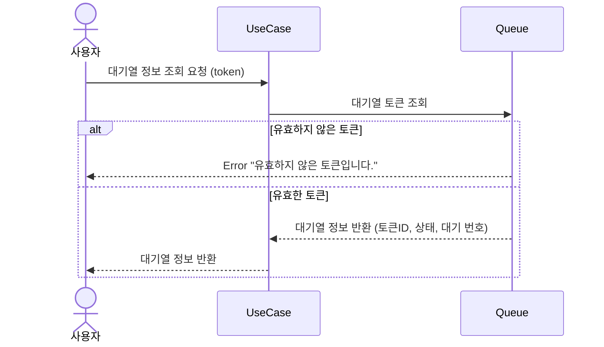
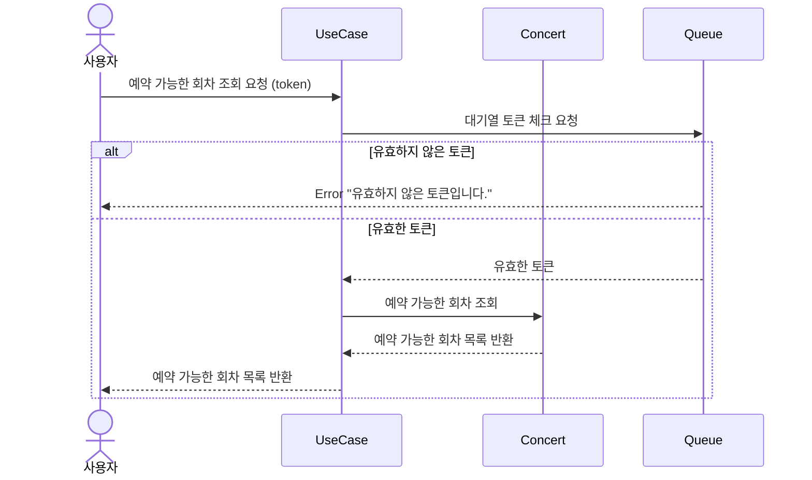
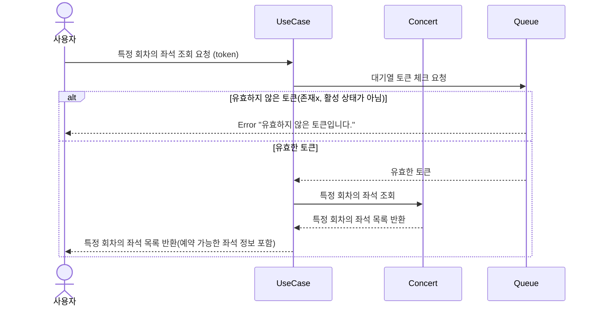
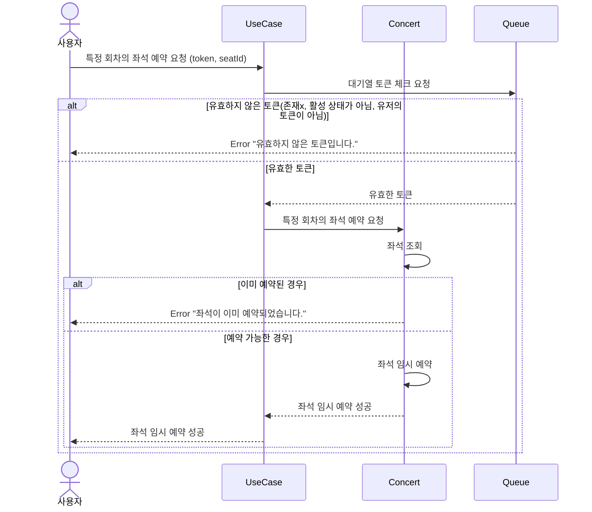
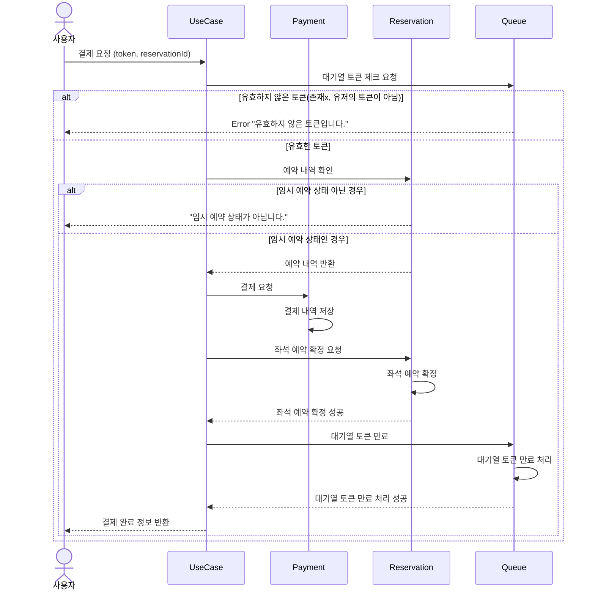

## 목록

---
1. [대기열 발급 요청](#1-대기열-발급-요청)
2. [대기열 조회 요청](#2-대기열-조회-요청)
3. [콘서트 예약 가능 회차(날짜) 조회](#3-콘서트-예약-가능-회차-조회)
4. [콘서트 회차 좌석 조회](#4-콘서트-회차-좌석-조회)
5. [콘서트 회차의 좌석 조회](#5-콘서트-회차의-좌석-예약)
6. [결제](#6-결제)
 

### 1. 대기열 발급 요청
---

### Description
대기열 토큰 발급 요청에 시퀀스 다이어그램입니다.
- 사용자가 대기열 토큰을 발급 요청하면, 시스템은 토큰을 생성합니다.
- 발급한 토큰을 대기열에 젖아합니다. 이때, 대기열 상태는 `대기`로 저장합니다.
- 대기열 정보를 반환합니다.

 

### 2. 대기열 조회 요청
---

### Description
대기열 정보 조회 요청에 대한 시퀀스 다이어그램입니다.

- 대기열 정보를 조회하여 대기 순서, 상태 등의 정보를 사용자에게 반환합니다.

 

### 3. 콘서트 예약 가능 회차 조회
---

### Description
콘서트 예약 가능 날짜 조회 요청에 대한 시퀀스 다이어그램입니다.
- 사용자가 대가열 토큰을 포함해 예약 가능한 회차를 조회 요청하면, 시스템은 해당 토큰이 유효한지 확인합니다.
- 토큰이 유효하지 않은 경우 에러 메시지를 반환합니다.
- 예약 가능 회차 목록을 조회하여 사용자에게 반환합니다.

 

### 4. 콘서트 회차 좌석 조회
---

### Description
콘서트 회차의 촤석 조회 요청에 대한 시퀀스 다이어그램입니다.
- 사용자가 대기열 토큰을 포함해 특정 회차의 좌석을 조회 요청하면, 시스템은 해당 토큰이 유효한지 확인합니다.
- 토큰이 유효하지 않거나 활성 상태가 아닌 경우 에러 메시지를 반환합니다.
- 예약 가능한 회차의 좌석 목록을 조회하여 사용자에게 반환합니다.

 

### 5. 콘서트 회차의 좌석 예약
---

### Description
콘서트 회차의 좌석 예약 요청에 대한 시퀀스 다이어그램입니다.
- 사용자가 대기열 토큰을 포함해 특정 회차의 좌석을 예약 요청하면, 시스템은 해당 토큰이 유효한지 확인합니다.
- 토큰이 유효하지 않은 경우 에러 메시지를 반환합니다.
- 토큰이 활성 상태가 아닌 경우 에러 메시지를 반환합니다.
- 좌석이 이미 예약된 경우 에러 메시지를 반환합니다.
- 좌석이 예약 가능한 경우, 좌석을 임시 예약하고 사용자에게 성공 메시지를 반환합니다.
- 좌석 임시 예약은 다른 사용자가 예약할 수 없도록 잠금 처리됩니다.

 

### 6. 결제
---

### Description
결제 요청에 대한 시퀀스 다이어그램입니다.
- 사용자가 대기열 토큰을 포함해 예약한 좌석을 결제 요청하면, 시스템은 해당 토큰이 유효한지 확인합니다.
- 토큰이 유효하지 않은 경우 에러 메시지를 반환합니다.
- 임시 예약 상태를 확인 요청하면, 임시 예약 상태인지 확인하여 아닌 경우 에러 메시지를 반환합니다.
- 결제 요청을 받은 시스템은 결제 완료를 합니다.
- 임시 예약 상태를 `확정` 상태로 변경합니다.
- 결제 완료 후, 대기열 토큰을 만료 처리합니다.
- 결제 완료 정보를 사용자에게 반환합니다.

 

 

